# 🚀 Kind FluxCD GitOps CI - Quick Start

## 📝 Overview

Automated CI pipeline that tests GitOps changes on an ephemeral Kubernetes cluster (kind) before merging to `main`.

**Features**:
- ✅ Automatic FluxCD bootstrap on current branch
- ✅ Removes `pod_environment_secret` from Postgres Operator (test only)
- ✅ Excludes backup CronJobs: `harbor-db-backup` and `nextcloud-db-backup`
- ✅ Automatic configuration verification
- ✅ Automatic cluster cleanup

## 🎯 How It Works

### Automatic Trigger

The pipeline starts automatically when:
1. **Push to feature branch** (not `main`)
2. **Pull Request** to `main`

```bash
# Example: create feature branch and push
git checkout -b feature/update-configs
git add .
git commit -m "Update Harbor configuration"
git push origin feature/update-configs

# Pipeline starts automatically!
```

### Pipeline Workflow

```mermaid
graph TD
    A[Push/PR] --> B[Create Kind Cluster]
    B --> C[Generate Test Overlay]
    C --> D[Commit Temporary Overlay]
    D --> E[Push Branch]
    E --> F[Bootstrap Flux with MAIN]
    F --> G[Patch: GitRepo → Current Branch]
    G --> H[Patch: Path → kubenuc-kind]
    H --> I[Flux Reconciles]
    I --> J{Verifications}
    J -->|✅ Pass| K[Smoke Test]
    J -->|❌ Fail| L[Log Errors]
    K --> M[Cleanup: Remove Overlay]
    L --> M
    M --> N[Cleanup: Delete Cluster]
```



**⚠️ Important note**:
1. The pipeline **bootstraps Flux with the `main` branch** (stable configuration)
2. Then **patches to use the current branch** with test overlay
3. The overlay `clusters/kubenuc-kind/` is **automatically removed** at the end

## 🔧 Test Cluster Modifications

### 1️⃣ Postgres Operator

**Production** (`clusters/kubenuc/apps/postgresql/manifests/release.yml`):
```yaml
values:
  configKubernetes:
    cluster_name_label: ranchernuc
    pod_environment_secret: postgres-object-store-credentials  # ← This line
```

**Test** (generated automatically in `clusters/kubenuc-kind/`):
```yaml
values:
  configKubernetes:
    cluster_name_label: ranchernuc
    # pod_environment_secret automatically removed!
```

### 2️⃣ Backup CronJobs

**Excluded from test**:
- `clusters/kubenuc/apps/harbor/manifests/backup.yml` ❌
- `clusters/kubenuc/apps/nextcloud/manifests/backup.yml` ❌

The pipeline creates overlays that **DO NOT include** these files.

## 📊 Monitoring

### Via GitHub UI

1. Go to **Actions** tab
2. Select workflow **Kind FluxCD GitOps CI**
3. Monitor logs

### Via CLI

```bash
# List workflow runs
gh run list --workflow=kind-flux-ci.yml

# Show logs in real-time
gh run watch

# View details of last run
gh run view --log
```

## ✅ Success Criteria

The pipeline passes if:
- ✅ Kind cluster created
- ✅ Flux bootstrap completed
- ✅ GitRepository `Ready`
- ✅ Kustomization `Ready`
- ✅ `pod_environment_secret` NOT present
- ✅ Backup CronJobs NOT present
- ✅ Pods started correctly

## 📁 Created Files

### GitHub Actions Workflow
- [.github/workflows/kind-flux-ci.yml](.github/workflows/kind-flux-ci.yml)

### Documentation
- [docs/kind-flux-ci.md](docs/kind-flux-ci.md) - Complete documentation

## 🛠️ Test Overlay Structure (Ephemeral)

During the pipeline, this is created **temporarily**:

```
clusters/kubenuc-kind/          # ← Generated only in CI, never committed
├── flux-system/
│   └── gotk-sync.yaml          # Current branch
├── apps/
│   ├── postgresql/
│   │   └── manifests/
│   │       └── release.yml     # Without pod_environment_secret
│   ├── harbor/
│   │   └── manifests/          # Without backup.yml
│   └── nextcloud/
│       └── manifests/          # Without backup.yml
└── charts/
```

**IMPORTANT**: This structure exists **ONLY in the CI runner** and is destroyed after each run.

## 🔒 Production Protection

**GUARANTEE**: The configuration in `clusters/kubenuc/` is **NEVER modified**.

- ✅ Overlays generated only in runner memory
- ✅ No automatic commits
- ✅ Production configuration intact
- ✅ Modifications isolated to test cluster

## 🎓 Practical Example

### Scenario: Update Harbor version

```bash
# 1. Create feature branch
git checkout -b feature/harbor-v2.12.0

# 2. Modify configuration
vim clusters/kubenuc/apps/harbor/manifests/release.yml
# Change version: 2.11.0 → version: 2.12.0

# 3. Commit and push
git add clusters/kubenuc/apps/harbor/manifests/release.yml
git commit -m "Update Harbor to v2.12.0"
git push origin feature/harbor-v2.12.0

# 4. Pipeline starts automatically!
# Go to GitHub Actions to monitor

# 5. If pipeline passes ✅, create PR
gh pr create --title "Update Harbor to v2.12.0" \
             --body "Upgrade Harbor Helm chart to version 2.12.0"

# 6. Merge after review
gh pr merge --auto --merge
```

## 📈 Metrics

- **Average duration**: 5-10 minutes
- **Maximum timeout**: 30 minutes
- **Cost (public repo)**: $0 (unlimited)
- **Resources**: 2 CPU, 7GB RAM (GitHub runner)

## 🐛 Troubleshooting

### Pipeline fails and leaves overlay in branch

**Cause**: Pipeline interrupted before cleanup step.

**Solution**: Remove overlay manually:
```bash
git rm -rf clusters/kubenuc-kind/
git commit -m "cleanup: remove test overlay"
git push
```

### Pipeline fails on "Bootstrap Flux"

**Cause**: Flux components not ready in time.

**Solution**: Timeout is already configured to 5 minutes. If it persists, verify:
```bash
kubectl get pods -n flux-system
```

### Pipeline fails on "Wait for Flux reconciliation"

**Cause**: GitRepository cannot clone the branch.

**Solution**: Verify that the branch exists on GitHub and is pushed.

### Pipeline fails on verifications

**Cause**: Overlay not generated correctly.

**Solution**: Check log of step "Show generated overlay structure".

## 📚 Complete Documentation

For more details, see: [docs/kind-flux-ci.md](docs/kind-flux-ci.md)

## 🤝 Contributing

To modify the pipeline:

1. Edit [.github/workflows/kind-flux-ci.yml](.github/workflows/kind-flux-ci.yml)
2. Test on a feature branch
3. Open PR with changes

## 📞 Support

- 📖 [Complete documentation](docs/kind-flux-ci.md)
- 🐛 [Report issue](https://github.com/dark-vex/infra-cd/issues)
- 💬 [FluxCD Slack](https://fluxcd.io/community/)

---

**Ready to start?** Create a feature branch and push! 🚀
